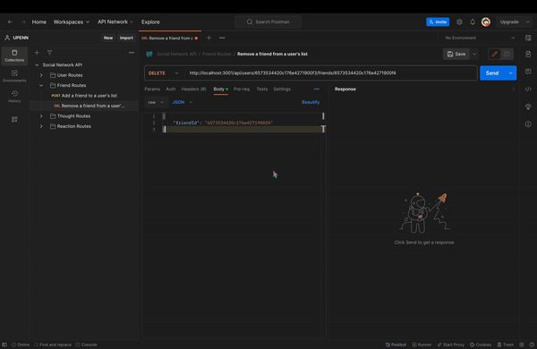
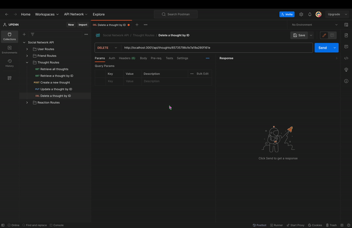

# NoSQL: Social Network API

## Description

This App is a social network API using MongoDB, Express.js, and Mongoose ODM. Features include user interactions for sharing and reacting to thoughts, and managing friends lists. Supports CRUD operations for user and thought data, emphasizing flexibility and efficiency with unstructured data management.

## Table of Contents

- [Installation](#installation)
- [Configuration](#configuration)
- [Database Setup](#database-setup)
- [Usage](#usage)
- [API Routes](#api-routes)
- [Data Models](#data-models)
- [Demonstration](#demonstration)
- [Contributing](#contributing)
- [License](#license)
- [Contact](#contact)

## Installation

Clone the repository to your local machine:

```
git clone git@github.com:Jackspence6/NoSQL-social-network-api.git
```

Navigate to the application directory and install dependencies:

```
npm install
```

## Configuration

Set up your environment variables. Create a `.env` file in the root directory with the following content:

```
DB_URI="your_mongodb_connection_string"
```

## Database Setup

1. **Install MongoDB:** Ensure MongoDB is installed on your machine and running.
2. **Start MongoDB Server:** Run the MongoDB server.
3. **Initialize Database:** In the MongoDB shell, create and switch to your database:

```
use socialNetworkDB
```

4. **Seed Data:** To populate the database with initial data, use the seed script provided:

```
npm run seed
```

## Usage

1. **Start the Server:**

```
npm start
```

2. **Development Mode:**

```
npm run dev
```

3. **Seeding the Database:**

```
npm run seed
```

The application will be running on `localhost:3001`.

## API Routes

### User Routes

- `GET /api/users` - Retrieve all users.
- `GET /api/users/:id` - Retrieve a user by ID with populated thought and friend data.
- `POST /api/users` - Create a new user.
- `PUT /api/users/:id` - Update a user by ID.
- `DELETE /api/users/:id` - Delete a user by ID.

### Friend Routes

- `POST /api/users/:userId/friends/:friendId` - Add a friend to a user's list.
- `DELETE /api/users/:userId/friends/:friendId` - Remove a friend from a user's list.

### Thought Routes

- `GET /api/thoughts` - Retrieve all thoughts.
- `GET /api/thoughts/:id` - Retrieve a thought by ID.
- `POST /api/thoughts` - Create a new thought.
- `PUT /api/thoughts/:id` - Update a thought by ID.
- `DELETE /api/thoughts/:id` - Delete a thought by ID.

### Reaction Routes

- `POST /api/thoughts/:thoughtId/reactions` - Add a reaction to a thought.
- `DELETE /api/thoughts/:thoughtId/reactions/:reactionId` - Remove a reaction from a thought.

## Data Models

### User Model

- Username (string, unique, required, trimmed)
- Email (string, required, unique, valid format)
- Thoughts (array of Thought IDs)
- Friends (array of User IDs)
- Virtual for `friendCount`

### Thought Model

- Text (string, required, 1-280 characters)
- CreatedAt (date, default to now, formatted)
- Username (string, required)
- Reactions (array of Reaction subdocuments)
- Virtual for `reactionCount`

### Reaction Schema

- ID (ObjectId, default to new ObjectId)
- Body (string, required, max 280 characters)
- Username (string, required)
- CreatedAt (date, default to now, formatted)

## Demonstration

### User Routes Demonstration

`GET /api/users` - Retrieve all users.


`GET /api/users/:id` - Retrieve a user by ID with populated thought and friend data.


`POST /api/users` - Create a new user.


`PUT /api/users/:id` - Update a user by ID.


`DELETE /api/users/:id` - Delete a user by ID.


### Friend Routes Demonstration

`POST /api/users/:userId/friends/:friendId` - Add a friend to a user's list.


`DELETE /api/users/:userId/friends/:friendId` - Remove a friend from a user's list.



### Thought Routes Demonstration

`GET /api/thoughts` - Retrieve all thoughts.


`GET /api/thoughts/:id` - Retrieve a thought by ID.


`POST /api/thoughts` - Create a new thought.


`PUT /api/thoughts/:id` - Update a thought by ID.


`DELETE /api/thoughts/:id` - Delete a thought by ID.




### Reaction Routes Demonstration

`POST /api/thoughts/:thoughtId/reactions` - Add a reaction to a thought.


`DELETE /api/thoughts/:thoughtId/reactions/:reactionId` - Remove a reaction from a thought.


## Contributing

Contributions are welcome. For major changes, please open an issue first to discuss your suggestions or improvements.

## License

[MIT](LICENSE)

## Contact

GitHub: [Jackspence6](https://github.com/Jackspence6)  
Email: [jackspence.dev@gmail.com](mailto:jackspence.dev@gmail.com)
